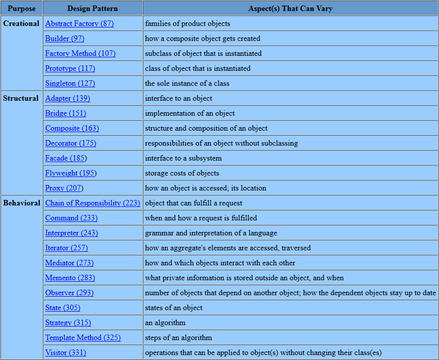
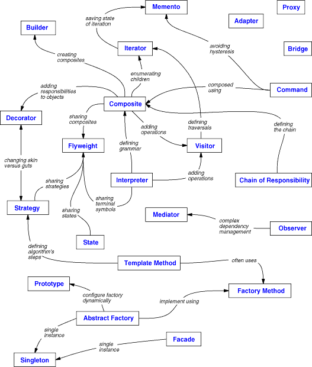

# Design patterns : modèles de conception 

## Règles à suivre 

Il faut programmer pour une interface, et non pour un développement.  
Il faut préférer la composition d'objets à l'héritage de classes. 
On cherche à déléguer le plus possible : une classe doit, de préférance, ne faire 
qu'une seule chose. 

## Défauts courants 

Cette liste répertorie les défauts plus courants d'une conception à objets, ainsi 
qu'un modèle adapté à la résolution de ce problème : 

- Créer un objet en spécifiant explicitement sa classe (*Factory, Abstract 
Factory, Prototype*)
- Assujetissement à une opération particulière (*Chain of responsability, 
Command*)
- Dépendance vis à vis des plate-formes matérielles et logicielles (*Abstract 
Factory, Bridge*)
- Assujetissement à la représentation d'un objet ou à son code (*Abstract 
Factory, Bridge, Memento, Procuration*)
- Assujetissement à un algorithme (*Builder, Iterator, Strategy, Template 
method, Visitor*)
- Couplage fort (*Abstract Factory, Bridge, Chaine of responsability, Command, 
Facade, Mediator, Observer*)
- Extension des fonctionnalités par sous-classe (*Bridge, Chaine of responsability, 
Composite, Decorator, Observer, Strategy*)
- Impossibilité de modifier convenablement des classes (*Adapter, Decorator, 
Visitor*)

## Choisir un modèle 

## Liens entre modèles 

