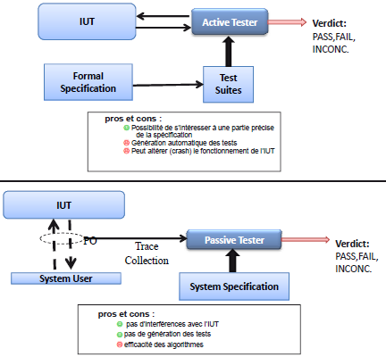

# Ingénierie des protocoles - cours 1 

## Erreurs et Pannes 

L'homme fait des **Fautes/Erreurs** qui mènent à une **Faute** dans le 
système, qui mène à une **Panne** du système.  
Une *erreur*, c'est quand l'homme a écrit du code qui a une *faute*.  
Une *faute*, c'est une partie du code qui, exécutée, peut mener à une *panne*. 
Une *panne* est un comportement **observable** du système qui n'est pas 
conforme au cahier des charges. Le **test** permet la détection des *pannes* 
par l'exécution du système - processus intégrant les activités de sûreté de 
fonctionnement (SdD ou *"dependability"*). 

## Qualités du logiciel 

Définies dans l'ISO 9126 :  
Functionality, Reliability, Maintainability, Usability, Efficiency, Portability

## Idées et Systèmes 

Le développeur a des idées, qui spécifient un cahier des charges, qui spécifie 
le système. 
L'homme développe le système. La vérification assure que le cahier des charges 
est conforme aux idées. Les tests assurent que le système est conforme au 
cahier des charges. Le développement suit un cycle de vie en V :  

## Phase de spécification 

La spécification décrit ce que fait le système, sans expliquer comment. Elle 
peut être **informelle** (basée sur les langages naturels), ou **formelle** 
(basée sur des notations mathématiques, avec des *modèles*).  

### Techniques de Descriptions Formelles (FDT) 

Les **FDT** normalisent la communication : 
- entre systèmes hétérogènes 
- entre réseaux de télécommunication communicants
- les normes (standars) contiennent à la fois une description des architectures 
(couches, services, protocles) en langage naturel **et** des diagrammes de 
transitions avec des tables d'états.  
Les spécifications contiennent des ambiguïtés, les FDT sont donc nécessaires.  
  
Ces techniques (appelées **langage de spécification**) spécifient les 
propriétés fonctionnelles (qualitatives) d'un système selon son environnement. 
Elles sont conçues pour décrire des systèmes distribués composés de processus 
exécutés en parallèle, se synchronisant et communiquant par messages.  
Il y a d'autres techniques : les algèbres de processus (CCS), les machines 
à états finis, la logique temporelle, ou les réseaux de Petri (en perte de 
vitesse).  
On compte parmi les FDT notamment **VHDL**, normalisé par IEEE, basé sur les 
FSM, synchrone, pour le Hardware.  
**SDL** (Specification Description Language) se base sur les ExtendedFSM 
asynchrones, et les types de données abstraits. Il profile UML et a 2 visions : 
graphique (SDL-GR) ou textuelle (SDL-PR).  
On voit aussi émerger **SYSML**, très utilisé de nos jours dans les grosses 
entreprises.  
  
Avantages :  

- Définitions stables et standardisées internationalement
- Evolution contrôlée
- Application à des systèmes réels à grande échelle
- Communauté importante d'utilisateurs 
- Réduit le coût du développement logiciel (correction rapide des erreurs) 
- Pas d'ambiguïtés
- Précis et cohérent (pas de contradictions) 
- Abstrait (par rapport à l'implémentation) 

## Les outils industriels 

- Editeurs graphiques et syntaxiques
- Parser / lexer 
- Vérificateurs (trouver les bons comportements)
- Simulateurs (de la spécification)
- Génération de code (C / C++)
- Générateurs de tests
- Execution de TTCN3 (langage de tests et protocoles de communication)

## La validation 

La **validation** inclue à la fois la **Vérification** (des specifications) et 
les procédures de **Test**. Il existe de nombreuses techniques de validation, 
aussi bien formelles qu'informelles. 

## Cahier des charges / spécification formelle 

Cette relation comporte à la fois une analyse statique (vérification de la 
syntaxe, référence inter-processus...) et une analyse dynamique (deadlock, 
reachability, logique temporelle, réseaux de Petri...).  
La **simulation** (deadlock, livelock, dead code...) se fait pas à pas, selon 
un schéma aléatoire, mais est exhaustive.  
  
Il existe 2 techniques majeures de *vérification formelle* : 

- La vérification du code, qui constitue en une analyse statique (sans modèles 
formels), du reverse engineering, ou des outils comme BLAST, Bandera, Verisoft
- La vérification des modèles par preuve

### Techniques de preuves 

Les **méthodes déductives** prouvent mathématiquement qu'une propriété 
extraite du cahier des charges est vérifiée dans le modèle. C'est 
essentiellement utilisé pour les propriétés fonctionnelles (qualitatives). 
La vérification fonctionne aussi sur des systèmes à états infinis.  
  
Le **model checking** consiste à trouver, dans un modèle formel, le 
contre-exemple d'une propriété définie logiquement. Il se base sur des modèles 
Markoviens. Bien adapté à la *QoS* (Quality of Service), il permet l'analyse de 
propriétés qualitatives aussi bien que quantitatives et est très répandu.  
Cette méthode aide à la modélisation et à l'obtention rapide des erreurs. 

## Test des implémentations 

Il y a des approches **informelles** pour les propriétés quantitatives (faisant 
partie de la QoS), basées sur des simulations / émulations.  
Les approches **formelles** définissent des relations d'équivalence entre la 
spécification formelle et des **IUT/SUT** (*System Under Test*). On cherche à 
générer des séquences de test depuis les spécifications et à les exécuter sur 
l'IUT. Ici la spécification est souvent basée sur des automates, et nécessite 
une architecture de test. On cherche une couverture maximale (très rare, il 
faut faire des concessions). Ces approches sont surtout pour les propriétés 
qualitatives. Pour les propriétés quantitatives, on a des modèles 
stochastiques et des prédicats (cf réseaux de Petri). 

### Tests actifs et tests passifs 

### Test partitionnés et tests aléatoires

Idéalement, un critère de test *C(protocol, model, test set)* induit une 
subdivision du domaine d'entrées en classes disjoints de **comportements 
équivalents** : un seul test dans chaque partition suffit pour contrôler le 
comportement de l'ensemble.  
En pratique, les sous-domaines sont souvent superposés et les comportements ne 
sont pas homogènes. Il y a donc deux manières de choisir ses tests.  
Pour choisir : 

- en partitionné (systématique), P = 1 - &Pi;(1 - &theta;j)
- en aléatoire (uniforme), P = 1 - &Pi;(1 - &theta;j)^k

Le critère de test *C(protocol, model, test set)* est utile : on peut dériver 
le *test set* pour générer ou séléctionner des tests automatiquement, et on 
peut voir si un *test set* est suffisant (avec des règles de stoppage et des 
critères d'adéquation). 

## White Box et Black Box 

Il y a deux grandes familles de critères de séléction des tests, qui sont 
souvent utilsiées de paire : 

- Test **Boite blanche** : analyse par mesures du code source (*couverture*)
- Test **Boite noire** : analyse d'un protocole à partir de son modèle 
(formel) ou du cahier des charges. 

### Critères de couverture de test

La **Couverture** est une mesure de *complétude* : une couverture de 100% ne 
signifie *jamais* "test complet", mais seulement qu'il est complet *pour la 
stratégie séléctionnée*. Il existe de nombreuses stratégies et mesures de 
couvertures, mais aucune n'est "meilleure" : tout dépend des cas.  
  
Le **critère de couverture de branches** dit qu'il faut que chaque branche de 
l'implantation soit exécutée par au moins un cas de test.  
Une suite de test T satisfait le **critère de branche** pour une *implantation 
I* ssi pour chaque branche B de I, il existe un case de test dans T qui cause 
l'exécution de B.  
La couveture de branche n'est pas garantie par la couverture des états. Elle 
est obligatoire dans le test unitaire. 

[arret page 51]