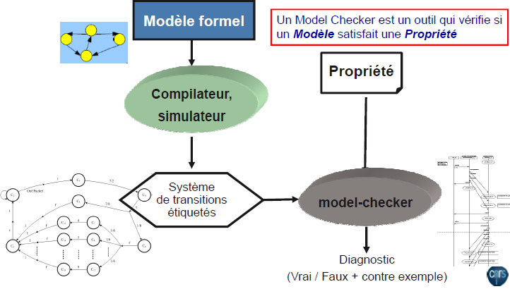
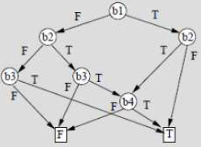

# Ingénierie des protocoles - Cours 3 : Vérification formelle 

## Techniques de vérification formelle

Il y a principalement 3 techniques pour faire de la vérification formelle :

- Equivalence des modèles : Pour comparer deux spécifications, on compare leurs
modèles. On veut prouver que le comportement d'un système est équivalent à un
comportement donné. Ce n'est pas réalisable sur de gros modèles.  
- Méthodes déductives (preuves) : On veut prouver qu'une propriété extraite des
spécifications est vérifiée mathématiquement dans son modèle.
- Model-checking : On veut trouver dans un modèle formel le contre-exemple
d'une propriété.

### Model-checking



Les **modèles** sont des *graphes annotés* de la forme (S, S<sub>0</sub>,
T, AP, L) avec :

- S l'ensemble des états
- S<sub>0</sub> l'état initial
- T&sube;S&10799;S l'ensemble des transitions
- AP l'ensemble des propositions atomiques (alphabet d'étiquettage)
- L : S&rarr;P(AP) la fonction d'étiquettage

Les modèles sont utiles pour la description d'un système lors de la
conception : le système doit être conforme à son modèle. Celui-ci peut servir
de départ pour le développement. On peut aussi les extraire d'un système après
observation.  

Un **système** est une entité dynamique embarquée dans le monde physique. Il
est observable via son interface, mais pas toujours contrôlable.  

On veut donc s'assurer qu'un système satisfait bien certaines **propriétés**,
exprimées soit en langage naturel, soit dans un langage logique, et sont un
ensemble de comportements attendus ou interdits.  
**modèle du système &#8872; propriété du système**
Le model-checking est de complexité linéaire, mais il peut être difficile d'exprimer
certaines propriétés (malgré des techniques avancées qui peut résoudre ce
problème).


#### Propriétés fonctionnelles

- Atteignabilité : un état du système peut être atteint
- Vivacité : un évènement attendu finira par arriver, sous certaines conditions
- Sûreté : un évènement indésirable ne se produira jamais
- Absence de blocage : le système pourra toujorus évoluer
- Equité : un évènement peut se produire infiniment souvent

## Logique CTL

La logique **CTL** (*Computation Tree Logic*) raisonne sur des arbres avec de la
logique temporelle :

- X &phi; : le prochain état satisfait &phi; (*neXt*)
- F &phi; : il existe un état dans lequel &phi; sera vraie (*Future*)
- G &phi; : tous les états satisfont &phi; (*Global*) = (&not;F&not;&phi;)
- &phi; U &psi; : &phi; est vraie jusqu'à cet état, et &psi; est vrai dans cet état
(*Until*)

On peut aussi raisonner sur tous les chemins à la fois :

- A &phi; : tous les chemins à partir de l'état courant satisfont &phi;
- E &phi; : (??) il existe un chemin à partir de l'état courant qui satisfait &phi;
- E F &phi; : (??) il existe un chemin à partir de l'état courant où &phi; est
toujours vraie
- A F &phi; : (??) tous les chemins à partir de l'état courant auront toujours &phi;

### Algorithme CTL

On pose *A* le modèle a états finis et *&phi;* une formule CTL. Chaque état *q*
de *A* et chaque sous-formule *&psi;* de *&phi;* sont marquées si
**q&#8872;&psi;**.  
On construit *q.&phi;* à partir de *q.&psi;*. *A&#8872;&phi;* ssi
q<sub>0</sub>.&phi; est vrai.  


## Model-checking symbolique : SAT / BDD

Le nombre d'états d'un système est exponentiel avec sa quantité de variables.
On veut restreindre le problème de l'explosion combinatoire, avec des techniques
comme l'exploration *on-the-fly* ou les abstractions.

### SAT

On note *Sat(&Phi;)* l'ensemble des états qui satisfont &Phi;.  
S&sube;Q, *Pre(S)* est l'ensemble des prédécesseurs immédiats de S.  

- Sat(&not;&Psi;) = Q\Sat(&Psi;)
- Sat(&Psi;<sub>1</sub>&and;&Psi;<sub>2</sub>)
= Sat(&Psi;<sub>1</sub>)&cap;Sat(&Psi;<sub>2</sub>)
- Sat(EX&Psi;) = Pre(Sat(&Psi;))
- Sat(AX&Psi;) = Q\Pre(Q\Sat(&Psi;))
- Sat(EF&Psi;) = Pre*(Sat(&Psi;))

On obtient **Pre*(S)** avec l'algorithme suivant :
```
X := S;
Y := {};
while Y != X do // calcul d'un point fixe
      Y := X;
      X := X + Pre(X); // en fait '+' c'est l'union
return (X);
```

Dans le cas où on a *A&Psi;<sub>1</sub>&cup;&Psi;<sub>2</sub>*, on a une
définition récursive :  
```
&Psi;1 &or; (&Psi;1 &and; EX true &and; AX(A&Psi;1&cup;&Psi;2)
       P1 := Sat[&Psi;1];
       P2 := Sat[&Psi;2];
       X := P2;
       Y := {};
       while Y != X do
             Y :=X;
  	 X := X + (P1 &and; Pre(Q) &and; (Q\Pre(Q\X)))
       return (X);
```

On recherche une implémentation efficace :

- pour représenter *Sat(f)* avec *f* atomique
- pour calculer *Pre(S)* depuis *S*
- pour calculer &cap;, &cup;, \
- pour l'égalité des ensembles

### BDD : Binary Decision Diagrams

On pose x<sub>1</sub>, ..., x<sub>n</sub> des variables booléennes et
\<b<sub>1</sub>, ..., b<sub>n</sub>> un vecteur de booléens.  
On veut représenter l'ensemble de vecteurs avec &Phi;(x<sub>1</sub>, ...,
x<sub>n</sub>) vraie. On utilise un **arbre de décision réduit**.  
En fait les sous-arbres étant les même sont partagés, et les choix inutiles sont
omis.  
  
*Ici si b<sub>1</sub> et b<sub>2</sub> sont vrais, b<sub>3</sub> devient
inutile*

On a quelques opérations faciles :

- l'ensemble vide est représenté par juste une feuille *F*
- deux ensembles sont égaux si ils ont le même *BDD*
- le complémentaire est construit en remplaçant les *T* par *F* et vice-versa
(- l'union et l'intersection sont par contre quadratiques...)

Le principe est de coder les états et transitions de l'automate par des *n*-uplets
de booléens.
```
Exemple :  
6 états q0...q5, une variable booléenne "open", et une variable "level" pouvant
valoir 0,1,2 ou ND.  
3 bits pour q, 1 pour open, 1 pour level :
FFT T FF <=> en q1, open=T et level=0
```

#### Calcul de Pre(S)

On construit BDD<sub>S</sub> avec b<sub>i</sub> &isin;BDD<sub>S</sub>
devient b'<sub>i</sub>, puis on construit
BDD'<sub>S</sub>&cap;BDD'<sub>S</sub> (l'ensemble des couples (s,s')
&isin;T tels que s'&isin;S).  
On peut ensuite oublier les b'<sub>i</sub>. Cela donne tous ce qu'il faut pour
implémenter le model-checker symbolique de CTL.

#### Exemple


