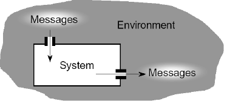
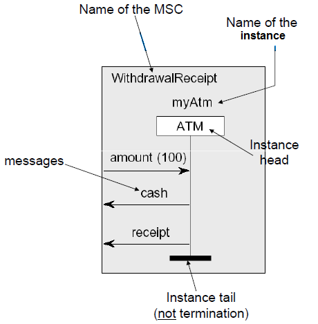
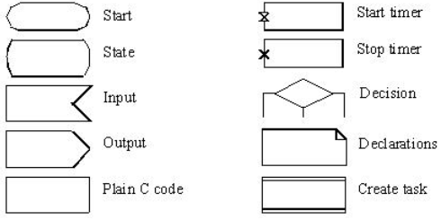
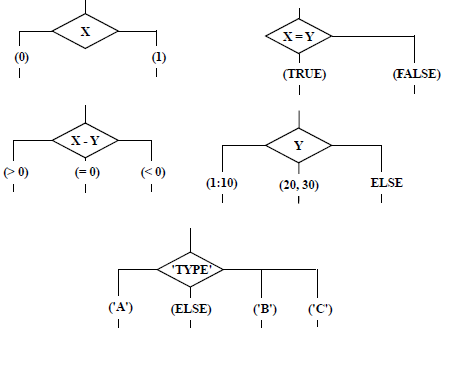
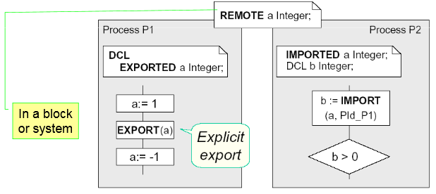
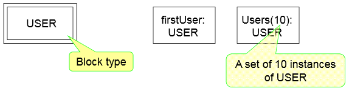
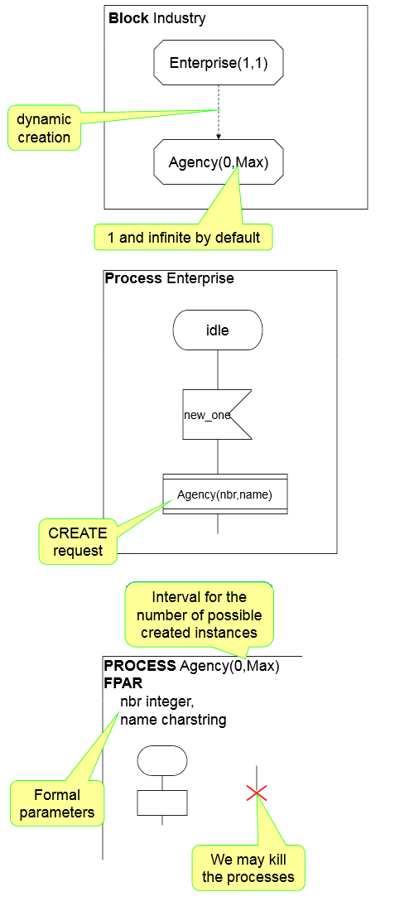
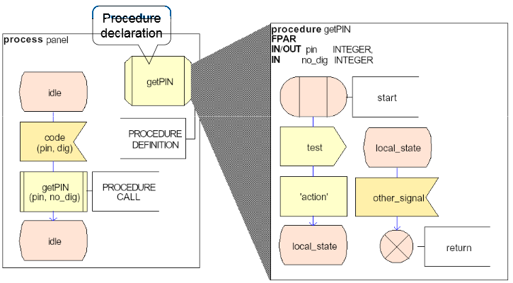

# Ingénierie des protocoles - Cours 5 : SDL

SDL représente la 1ère partie de l'examen : on doit résoudre un exo en format
SDL (architecture + comportement + MSC).  
2 parties : 1 sur des questions (1h30) sans documents, et l'autre sur SDL avec
documents.  
Certificat SysML : stanford

## Specification Description Language

**SDL** est une FDT (un langage de spécification).  
Ils permettent de spécifier les propriétés fonctionnelles d'un système selon
son environnement. Les FDT sont conçues pour décrire des systèmes distribués
qui communiquent par messages.  

SDL se base sur les ESFM et est asynchrone. Il spécifie et décrit sans
ambiguités les systèmes de communication.  
Les propriétés fonctionnelles d'un système peuvent être :

- propriétés structurelles : architecture, décomposition en blocs interconnectés
- propriétés comportementales : réactions du système après stimuli par son
environnement

### Système temps-réel

Un système logiciel en temps-réel :

- est capable d'intéragir avec l'environnement (via inputs et outputs)
- selon un temps de réponse compatible avec la dynamique de l'environnement
- afin de superviser, commander ou communiquer avec l'environnement à tout
moment



### Système distribué


### SDL pour les systèmes réactifs et discrets

La **communication** est l'échange de messages entre le système et son
environnement. Les interactions sont principalement asynchrones, même si le
synchrone est supporté.

SDL ne peut pas spécifier un nombre infini de données provenant de
l'environnement. SDL n'est pas adapté pour décrire les *interfaces graphiques*
et les *bases de données*.

## MSC : Message Sequence Chart

Une **MSC** décrit les échanges de messages entre composants du système, et
l'environnement. Cela permet d'observer les interactions.  


## Spécification d'un système

Il faut spécifier 3 aspects, dans l'ordre :

- définir la structure avec les interconnexions : *system, block, channel,
process*
- le comportement dynamique de chaque processus et leurs interactions :
*signals, variables input/output*
- les opérations sur les données : *variables, signals, sorts, ASN.1*


### Exemple

  
*Note* : Les signaux avec paramètres sont eux aussi écrits avec seulement leur
nom. Le paramètre n'apparaitra qu'à la partie *comportement*.  
*Note 2* : Un processus ne peut pas être au même niveau qu'un bloc dans la
hiérarchie.  

### Channels

Une **channel** peut être *unidirectionelle* ou *bi-directionnelle* :  


### Connexions entre blocs

Les connexions **doivent** être définies : quelles canaux sont liés, et quels
signaux y sont transmis.


### Types & opérations

**Types** : *INTEGER, REAL, CHARACTER, CHARSTRING, BOOLEAN, TIME (=REAL),
DURATION (=REAL), PID*.  
**Opérations** :  

- tous les types peuvent être comparés avec *=* et */=*.
- les nombres (*INTEGER, NATURAL, REAL*) disposent des opérations -, +, *, /,
<, >, <=, >=
- les nombres entiers et naturels disposent en plus de *Float, Mod, Rem*
- les nombres réels disposent en plus de *Fix*

#### Constantes

```SYNONYM nom INTEGER = 10;```

#### Types personnalisés

**Enumérations** :
```
NEWTYPE WeekDay
LITERALS mon, tue, wed, thu, fri, sat, sun;
ENDNEWTYPE;
```
**Plage** (souvent utiles pour les tableaux) :
```
SYNTYPE Digit_t = Character
CONSTANT '0':'9'
ENDSYNTYPE;

SYNTYPE WeekEnd = WeekDay
DEFAULT sun; CONSTANTS sat:sun
ENDSYNTYPE;
```

## Processus SDL

Le processus SDL va décrire le comportement et étendre le concept de FSM :  
- la queue associée à chaque processus n'est pas forcément FIFO
- une transition peut :
  + envoyer ou recevoir des données
  + analyser des variables pour déterminer la prochaine transition
  + exécuter des taches
  + appeler des procédures
  + créer des processus dynamiquement
  + déclencher des timers

Les éléments d'un processus :  


### Déclarations

On utilise le mot clé **dcl** pour les déclarations. Les variables se
déclarent dans le symbole **Text** et peuvent être initialisées.  
  
**Notes** :

- Le signal "*" permet la complétude de la spécification : n'importe quel
input.  
- Le raccourci "-" permet de revenir à l'état précédent.
- Quand un message est reçu dans un processus qui transporte une donnée,
celle-ci doit être mise dans une variable.
- Sur chaque transition, il ne peut y avoir qu'**1 input** (mais plusieurs
outputs).
- Si plusieurs signaux sont spécifiés en entrée, c'est un **OU**. En sortie,
c'est une séquence.

### Conditions

  

La condition doit considérer les vecteurs de variables de l'état d'avant, peu
importent les signaux recus. Les signaux ne sont consommés que si la condition
est vraie. Sinon ils sont sauvés (gardés à l'état suivant).

Les décisions :  
  

### Le temps

  

Il n'y a pas d'unité de temps dans les spécifications. Il faudra
faire *SET/RESET* à la main.  

### Variables distantes

On peut connaître la valeur de la variable d'un autre processus. DSL fait des
signaux implicites.  


### Structures

```
NEWTYPE Product
STRUCT
    ref CHARSTRING;
    price REAL;
    quantity INTEGER;
ENDNEWTYPE Product;
```
Bien sûr, le type des champs peut être une autre structure.  
Pour assigner : ```prod := (. <ref>,<price>,<quantity> .)```.  
Pour accéder : ```prod!price := 20.0```.  

Pour faire des tableaux :  
```
NEWTYPE Int_T
  ARRAY (Index_T, INTEGER);
ENDNEWTYPE
```
Ici, *Index_T=INTEGER*.  

Pour initialiser avec l'élément par défaut : ```tab := (. 0 .)```.  
Pour affecter/accéder : ```tab(1) := 2``` et ```x := tab(2)```.  

### Process type

On veut gérer plusieurs instances d'un même type de processus, avec chacun ses
objets actifs, ses actions, et données.  
On va mettre dans un package (importé avec ```USE```) une définition UML :  
  
Puis on pourra faire la définition du processus.  

Pour représenter l'ensemble des processus :  
  
Il ne faut pas oublier de **définir les portes** au bord du bloc d'instances.
Ce sont les *gates* via lesquelles les messages transitent.  

### Processus dynamiques

On peut créer dynamiquement des processus, qui vont avoir leur propre *PID*.  
  

Pour identifer les *PID* : *NULL, SELF, OFFSPRING, PARENT, SENDER*.  
Grâce aux *PID* et aux canaux, on peut envoyer précisément un message :
```<SIGNAL> TO <processus:nom ou PID> VIA <canal ou porte ou ALL>```

### Procédures

On peut factoriser des instructions :  
  
*IN* : par valeur (défaut), *IN/OUT* : par référence.  
Les procédures peuvent aussi retourner des valeurs, en
déclarant ````RETURNS r INTEGER```. On utilise dans un bloc d'instruction du
type ```x:= 5 * CALL <Procedure(x)>```
