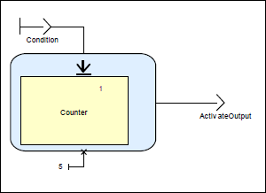
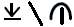

# Programmation synchrone - Cours 2 : Ordre supérieur

Les opérateurs d'ordre supérieur (*ordre 2*) prennent une fonction et la
transforment en autre chose (via *map*, *actcard*...).

### IF-Block

La différence avec un simple *IF*, c'est que le code d'une seule branche est
exécuté (les deux le sont avec *IF*).  

### When-Block

Un **When-Block** est un équivalent à un switch.  

### Condition d'activation

#### Activation

Si la condition est vraie, le bloc est activé. Sinon, le bloc ne fonctionne
plus et les sorties précédentes sont utilisées (ou des valeurs par défaut).  
Avant la 1ère utilisation, il y a des valeurs initiales.

#### Restart

Si la condition est vraie, la mémoire interne est remise à zéro.  

## Validation

On veut s'assurer que le programme est correcte :

- preuve : relecture manuelle
- simulation : on éxécute
- test : on simule plusieurs entrées choisies au préalable
- vérification : preuve et model-checking

SCADE dispose du model-checking automatique, appelé "**PROOF**".  
Il peut vérifier des propriétés de sûreté (type "rien de mauvais ne peut
arriver").

- on voit la propriété
(- on ajoute des assertions)
- on crée un noeud *"property verifier"*, qui prend les entrées/sorties de la
fonction, et renvoie *OK=true* si la propriété est vérifiée

Il y a alors 3 cas :

- SCADE trouve une erreur (une entrée pour laquelle *OK=false*). Donc la
propriété est violée, on peut alors faire une simulation pour comprendre la
cause
- SCADE peut démontrer que *OK=true* pour toute entrée
- la preuve échoue
