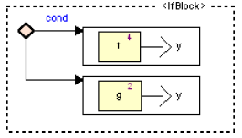
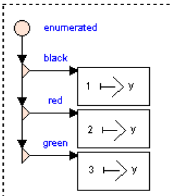

# Programmation synchrone - Cours 2

## Ordre supérieur 

Les opérateurs d'ordre supérieur (*ordre 2*) prennent une fonction et la 
transforment en autre chose (via *map*, *actcard*...). 

### IF-Block

La différence avec un simple *IF*, c'est que le code d'une seule branche est 
exécuté (les deux le sont avec *IF*).  

### When-Block

Un **When-Block** est un équivalent à un switch.  

### Condition d'activation

#### Activation

Si la condition est vraie, le bloc est activé. Sinon, le bloc ne fonctionne plus et 
les sorties précédentes sont utilisées (ou des valeurs par défaut).  
Avant la 1ère utilisation, il y a des valeurs initiales. 

#### Restart

Si la condition est vraie, la mémoire interne est remise à zéro.  

## Validation

On veut s'assurer que le programme est correcte : 

- preuve : relecture manuelle
- simulation : on éxécute
- test : on simule plusieurs entrées choisies au préalable
- vérification : preuve et model-checking

SCADE dispose du model-checking automatique, appelé "**PROOF**".  
Il peut vérifier des propriétés de sûreté (type "rien de mauvais ne peut arriver"). 

- on voit la propriété
(- on ajoute des assertions)
- on crée un noeud *"property verifier"*, qui prend les entrées/sorties de la 
fonction, et renvoie *OK=true* si la propriété est vérifiée

Il y a alors 3 cas : 

- SCADE trouve une erreur (une entrée pour laquelle *OK=false*). Donc la 
propriété est violée, on peut alors faire une simulation pour comprendre la cause
- SCADE peut démontrer que *OK=true* pour toute entrée
- la preuve échoue

## Automates 

Un noeud SCADE contient les équations, les diagrammes de flots, mais aussi les 
automates. Ceux-ci contiennent des états et des transitions.  
Un **état** contient des diagrammes de flot, des expressions, des automates.  
Une **transition** contient des gardes, des actions, des propriétés, un "type", 
un historique, et peut avoir une priorité.  
  
L'automate suit la *sémantique synchrone* : à chaque tick, un état est éxécuté 
et on passe une transition.  
Au final, un automate est une manière plus simple d'écrire les flots. D'ailleurs, on 
peut traduire l'automate vers des équations de flots.  

Il y a trois types de transitions. 

### Transition forte 

A chaque tick : 

- on teste la garde
- si possible, on fait la transition
- on éxécute l'état dans lequel on se trouve (donc après)

Quand il y a **plusieurs transitions sortantes**, il faut leur donner une 
**priorité** (priorité basse = faite avant). 

**Remarque** : quand on rentre dans un état, il est initialisé. Si on veut qu'un 
état ne soit pas réinitialisé (il garde les valeurs de ses variables), il faut faire 
une transition *historique*. 

### Synchronisée 

Ni faible ni forte, sans garde. Quand tous arrivent vers leur état final, alors la 
transition synchronisée se déclenche.