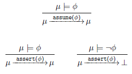
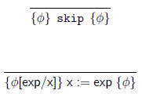
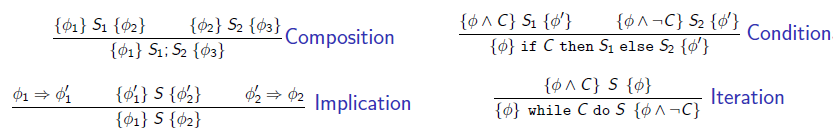

# Vérification - Cours 4 : Preuves de programmes impératifs

## Programmes séquentiels impératifs 

Soit *X* un ensemble de variables typées déclarées dans le programme.  
Les valeurs stockées dans ces variables appartiennent à un domaine *D*. On 
donne *Op* l'ensemble des opérations et *Rel* l'ensemble des relations sur *D*. 
Les commandes d'un programme sont définies comme suit : 
```
S ::= skip
   | x := E
   | S ; S
   | if C then S else S
   | while C do S
```
où *E* est un terme et C est une formule sur *X* sans quantificateurs dans 
*FO(D,Op,Rel)* (logique du 1er ordre, *First Order*).

## Sémantique des programmes 

Les programmes impératifs transforment les états de la mémoire, et sont donc 
vues comme des machines à états finis.  
Un état correspod à une *valuation* des variables du programme *&mu;:X&rarr;D*  
Les transitions entre états correspondent à l'exécution de commandes : 
&mu; &rArr;<sub>S</sub>&mu;'

## Règles de transitions 


## Assertions 

Les assertions sur les états du programme peuvent être exprimées dans la 
logique du 1er ordre sur X. On définit deux commandes spéciales : 
**assume(&phi;)** et **assert(&phi;)** (où &phi; est une formule sur X).  
La sémantique :  
  
avec &perp; un état spécial : **erreur**.

## Invariants de boucles 

Un **invariant de boucle** est une propriété qui est vraie initialement, et 
après chaque itération. Un invariant utile : après la dernière itération, il 
implique la post-condition désirée. 

## Méthodologie de programmation 

- Définir les états du programme, avec les variables et leur type
- Définir l'état initial (supposé) et l'état final (assuré)
- Définir les calculs itératifs, prouver les invariants de boucle

## Raisonner sur les pre/post-condition 

On considère des formules de la forme {&phi;}S{&psi;} où *S* est une commande, 
*&phi;* et *&psi;* sont des assertions. Ce sont des **triplets de Hoare**.  
*&phi;* est la **pre-condition** et &psi; est la **post-condition**.  
En partant d'un état qui satisfait &phi;, si l'exécution de *S* termine, alors 
l'état atteint doit satisfaire *&psi;.  
Formellement :  
{&phi;}S{&psi;} ssi  
&forall;&mu;, &mu;'. (&mu; &#8872; &phi; &and; &mu; &rarr;<sub>S</sub>&mu;') 
&rArr; &mu;' &#8872; &psi;  
On cherche à prouver la validité de telles formules. 

## Logique de Hoare 

### Axiomes pour les commandes basiques

 

On voit que la règle d'assignement va **à l'envers** : on prend la 
post-condition et on la met en pré-condition en substituant selon l'expression.

### Règles d'inférences


Implication : en gros a remplacé la pré-condition par un fait plus fort, et la 
post-condition par un fait plus faible. 
## Conclusion 

Les programmes impératifs transforments des états mémoire : ils peuvent être 
vus comme des machines à états.  
Des assertions sur les états peuvent être écrites dans des langages de 
spécification logiques.  
A programme doit être annoté avec des assertions spécifiant les suppositions 
concernant l'état initial, les garanties sur l'état final, et des invariants 
de boucle.  
Le raisonnement sur les pre/post-conditions permettent de vérifier que les 
garanties sont bien satisfaites, considérant les suppositions.  
La preuve de validité des triplets de Hoare doit être faite en considérant la 
théorie sur les données.  
De telles preuves peuvent être faites à la main, ou en utilisant des prouveurs 
de théorèmes, ou encore automatiquement avec des procédures de décision. 